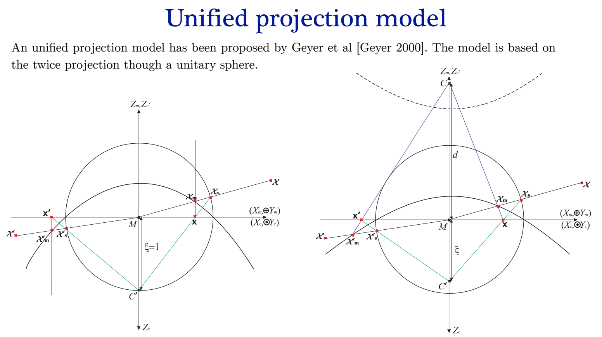

# Unified Projection Model

In this folder I will try to reproduce the Unified Projection Model described in the class of Prof. Hicham Hadj-Abdelkader. Originally proposed by Geyer and Daniilidis. The model consists of a central camera in front of a hyperbolic mirror. Then, we define a virtual spherical mirror. 

# Camera Calibration
Below is the link to the OpenCV tutorial for the Omnidirectional Camera Calibration. 

https://docs.opencv.org/4.x/dd/d12/tutorial_omnidir_calib_main.html

## Camera Calibration from Scratch
For the camera calibration I will use the chessboard image. Using a least sqares minimization I can find the intrinsic parameters of the camera. The steps are as follows: 

1. Take 3 to 5 images of the chessboard from different angles.
2. Find the corners of the chessboard on each image (I could use my function, but it needs to be improved).
3. Asume initial values for the intrinsic properties of the camera.
4. Find the extrinsic parameters of the camera for each image.
5. Unproject the corners of the chessboard to the 3D space.
6. Measure the distance between the corners of the chessboard.
7. Minimize the distance between the corners of the chessboard and the unprojected corners of the chessboard.

# References
- https://pagesperso.ls2n.fr/~martinet-p/publis/2010/springer10hicham.pdf
- https://link.springer.com/chapter/10.1007/3-540-47979-1_16#preview
- https://ieeexplore.ieee.org/stamp/stamp.jsp?tp=&arnumber=1453519
- https://www-sop.inria.fr/members/Philippe.Martinet/publis/2006/cdc06hicham.pdf