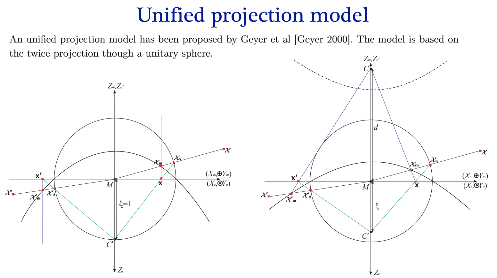

# Unified Projection Model

In this folder I will try to reproduce the Unified Projection Model described in the class of Prof. Hicham Hadj-Abdelkader. Originally proposed by Geyer and Daniilidis. The model consists of a central camera in front of a hyperbolic mirror. Then, we define a virtual spherical mirror. 

# Camera Calibration
Below is the link to the OpenCV tutorial for the Omnidirectional Camera Calibration. 

https://docs.opencv.org/4.x/dd/d12/tutorial_omnidir_calib_main.html

# References
- https://pagesperso.ls2n.fr/~martinet-p/publis/2010/springer10hicham.pdf
- https://link.springer.com/chapter/10.1007/3-540-47979-1_16#preview
- https://ieeexplore.ieee.org/stamp/stamp.jsp?tp=&arnumber=1453519
- https://www-sop.inria.fr/members/Philippe.Martinet/publis/2006/cdc06hicham.pdf